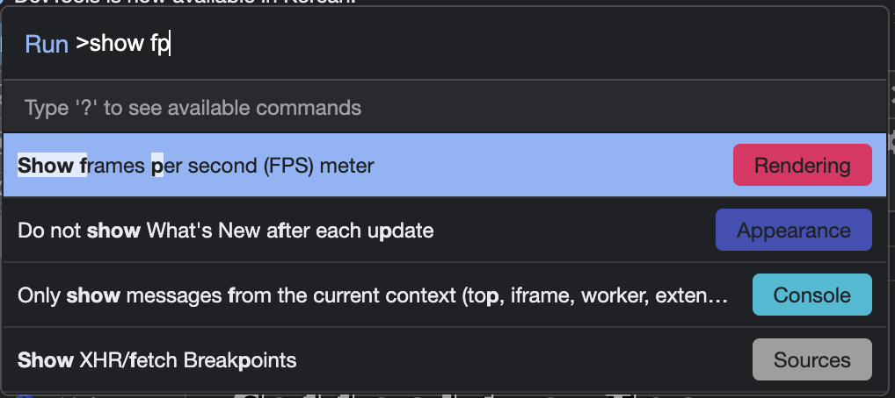
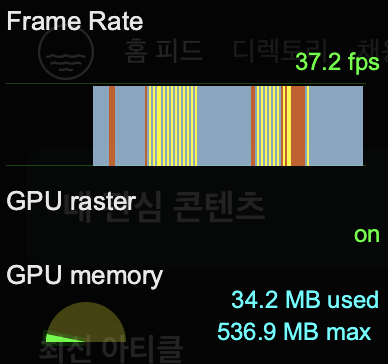

## 2. Rendering

---

> learn how to effectively manipulate DOMs without frameworks.

### The Document Object Model

- every HTML page(or a fragment of it) is a **tree**🌳
- DOM is a way to **manage** the tree defined by _HTML elements._

```html
<body>
  <div class="box">box</div>
  <script>
    const box = document.querySelector(".box");
    box.style.color = "red";
  </script>
</body>
```

1. select the box with the `querySelector`(Node method) method.
2. change the style property of the box

- Node : **basic interface** that represents a node in HTML

<br />

### Monitoring Rendering Performance

- important factor in a rendering engine : _readablility, maintainability, performance_

### Chrome Developer Tools

- FPS(frames-per-second)
  
- displays the amount of memory used by the GPU
  

### stats.js

[stats.js](https://github.com/mrdoob/stats.js/)

<br />

### Rendering Functions

> view = f(state)

### Pure Functions Rendering

- view.ts

```javascript
export default (targetElement, state) => {
  // 1
  const { currentFilter, todos } = state;
  const element = targetElement.cloneNode(true); // 2 노드 복제

  // 복제한 노드를 수정한다
  const list = element.querySelector(".todo-list");
  const counter = element.querySelector(".todo-count");
  const filters = element.querySelector(".filters");

  list.innerHTML = todos.map(getTodoElement).join("");
  counter.textContent = getTodoCount(todos);

  let links: HTMLElement[] = Array.from(filters.querySelectorAll("li a"));
  links.forEach((a) => {
    if (a.textContent === currentFilter) {
      a.classList.add("selected");
    } else {
      a.classList.remove("selected");
    }
  });

  return element; // 3
};
```

1. target DOM element used as a base.
2. **clones** the original node and **updates** it using the state parameter.

- `cloneNode()`: 이 메서드를 호출한 Node 의 **복제된 Node**를 반환
- Keep in mind that modifying a **detached DOM** element is _performant._

3. returns new node.

<br />

Controller.ts

- connect view function to the real DOM

<br />

**rendering engine**

- [window.requestAnimationFrame - mdn](https://developer.mozilla.org/ko/docs/Web/API/Window/requestAnimationFrame)
- don't block the main thread.
- excuted right before the next repaint is scheduled in the event loop.

<br />

**Static Rendering schema**  
Browser Rendering ➡️ Wait Next Render ➡️ New Virtual Node ➡️ DOM Manipulation ➡️ Browser Rendering
